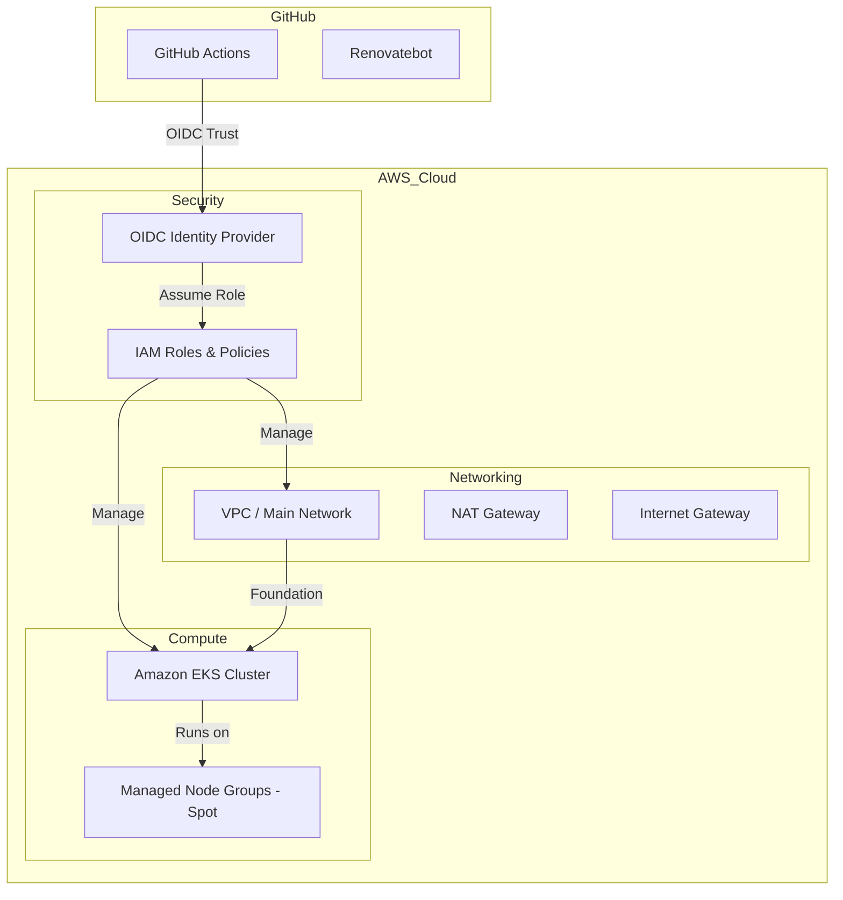

# 🏗️ AWS Infrastructure Foundation

A professional-grade, multi-environment infrastructure-as-code repository managed with **Terragrunt** and **Terraform**. This project demonstrates industry best practices for modularity, automated dependency management, and secure CI/CD pipelines.

## 🌟 Key Features

*   **Multi-Environment Architecture**: Dry, hierarchical configuration using Terragrunt for `dev` and `prod` environments.
*   **Infrastructure-as-Code**: 100% declarative infrastructure using AWS public modules for VPC, EKS, and IAM.
*   **Automated Dependency Updates**: Integration with **Renovatebot** to keep Terraform and Terragrunt modules up-to-date.
*   **Secure CI/CD**: GitHub Actions pipeline using **OIDC (OpenID Connect)** for passwordless authentication to AWS.
*   **Cost Efficiency**: Use of **Spot Instances** for EKS Managed Node Groups in development environments.

## 🏗️ Architecture Overview



## 📁 Repository Structure

```text
.
├── .github/workflows/      # CI/CD pipelines (GitHub Actions)
├── modules/                # Reusable, local Terraform modules
│   └── s3/                 # Example local module for S3 buckets
├── live/                   # The hierarchical environment configuration
│   ├── root.hcl            # Global settings (Backend & Provider generation)
│   ├── dev/
│   │   ├── account.hcl     # Dev account-specific variables (Account ID, Alias)
│   │   ├── env.hcl         # Dev environment-specific variables
│   │   └── ap-south-2/
│   │       ├── region.hcl  # Region-specific variables
│   │       ├── network/    # VPC and networking layer
│   │       ├── security/   # IAM and OIDC Trust configurations
│   │       └── compute/    # EKS and Kubernetes resources
│   └── prod/               # Production environment (mirrors dev structure)
```

### 🧬 How it works: Terragrunt Inheritance
This project uses a "Deep Merge" strategy to keep code DRY (Don't Repeat Yourself):
1.  **`root.hcl`**: Automatically creates the S3 backend and the AWS provider for every module.
2.  **`account/env/region.hcl`**: These files define variables at each layer.
3.  **Module `terragrunt.hcl`**: The final child configuration reads all parent files and injects them as variables.

---

## 🚀 Getting Started

### Prerequisites
*   [Terraform](https://www.terraform.io/downloads.html) v1.10+
*   [Terragrunt](https://terragrunt.gruntwork.io/docs/getting-started/install/) v0.50+
*   [AWS CLI](https://aws.amazon.com/cli/) configured with appropriate permissions.

### Deployment Sequence
To stand up the environment, deploy in this specific order to respect dependencies:
1.  **OIDC Provider**: `live/dev/ap-south-2/security/github-oidc-provider` (Run this once!)
2.  **OIDC Role**: `live/dev/ap-south-2/security/github-oidc-role`
3.  **Network**: `live/dev/ap-south-2/network/vpc`
4.  **Compute**: `live/dev/ap-south-2/compute/eks`

---

## 🤖 Automation & Security

### Secure CI/CD (GitHub Actions + OIDC)
The pipeline defined in `.github/workflows/terragrunt.yml` uses **OIDC (OpenID Connect)**. 
*   **Keyless**: No AWS Access Keys are stored in GitHub Secrets.
*   **Trust-Based**: AWS trusts the GitHub identity token based on the OIDC Provider we created.
*   **Scoped**: The IAM Role is restricted to only allow this specific GitHub repository to assume it.

### Automated Dependency Management (Renovatebot)
Controlled via `renovate.json`, the project automatically receives PRs for module updates, ensuring the platform stays modern with zero manual effort.

---

*This project is part of my professional DevOps/Platform Engineering portfolio. For more information, please visit my [GitHub profile](https://github.com/karthik-orugonda).*
