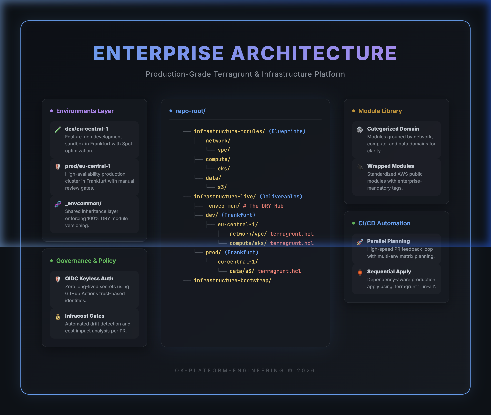
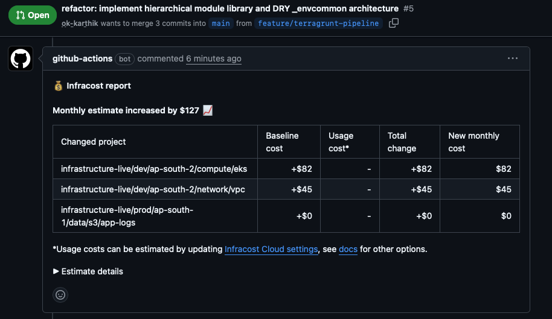
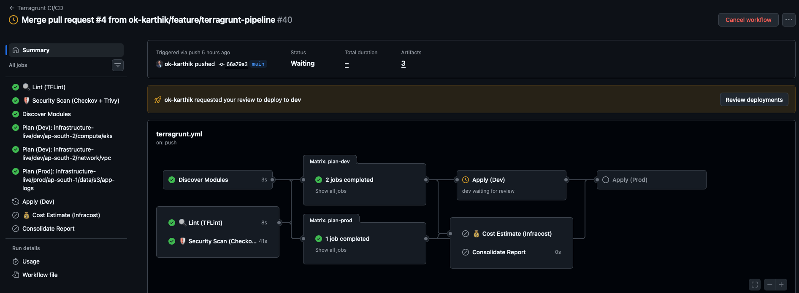
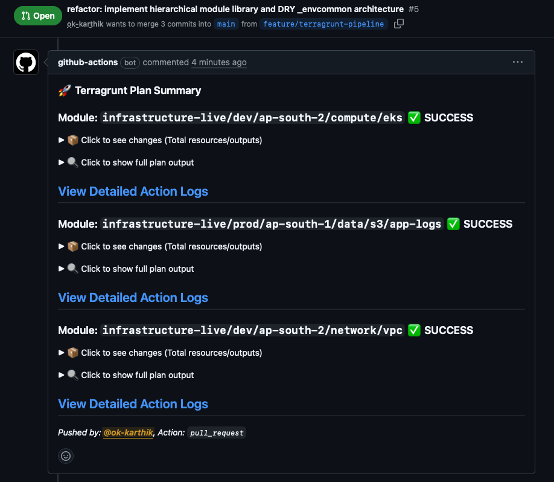

# 🏗️ Enterprise AWS Platform (Terragrunt & Terraform)

[](https://terragrunt.gruntwork.io/)
[](https://www.terraform.io/)
[](https://github.com/bridgecrewio/checkov)
[](LICENSE)

A production-grade, multi-environment AWS platform architecture designed for scalability, security governance, and FinOps efficiency. This project demonstrates **Staff Engineer level patterns** in Infrastructure-as-Code (IaC) management, focusing on modularity, policy-driven security, and automated delivery.

<p align="center">
  
</p>

---

## 🏛️ Project Architecture

This platform follows a **Hierarchical Blueprint Pattern** using Terragrunt. It separates the "Generic Blueprint Library" from the "Live Environment Implementation," ensuring 100% DRY (Don't Repeat Yourself) code.

### 🧬 Repository Structure

```text
.
├── .github/workflows/          # 🛡️ 5-Stage Multi-Environment Pipeline
├── infrastructure-modules/      # 📦 The Blueprint Library (Reusable)
│   ├── network/                # VPC, Transit Gateway, Private Links
│   ├── compute/                # EKS, Lambda, Auto-scaling
│   └── data/                   # RDS, S3, OpenSearch
├── infrastructure-live/         # 🚀 The Deployment Hub (Stateful)
│   ├── _envcommon/             # 🧬 DRY inheritance layer (Centralized versions)
│   ├── dev/                    # Development Environment (Low cost, high speed)
│   │   ├── env.hcl             # Env-specific overrides (Spot instances, logging)
│   │   └── eu-central-1/        # AWS Region (Frankfurt)
│   └── prod/                   # Production Environment (High availability)
└── infrastructure-bootstrap/   # 🗝️ Entry-point (OIDC & Remote State Hub)
```

---

## 🚀 The Automated Platform (CI/CD)

The core of this platform is a sophisticated **5-Stage Pipeline** that transitions infrastructure from code to production with multiple security and cost gates.

### 🚀 Dual-Gate Pipeline Architecture
The platform utilizes a **Modular CI/CD Orchestration** model built on GitHub Reusable Workflows and Composite Actions. This ensures a DRY (Don't Repeat Yourself) pipeline that is both fast and extremely secure.

1.  **Gate 1: High-Speed Static Analysis (HCL)**
    *   **Goal**: Immediate feedback for developers.
    *   **Tools**: TFLint (Quality), Trivy (IaC Security), Checkov (Basic HCL misconfigs).
    *   **Scope**: Scans the raw code before any AWS credentials are required.

2.  **Gate 2: High-Precision Governance (JSON)**
    *   **Goal**: Final safety check before deployment.
    *   **Tools**: **Checkov (JSON Plan)**, **OPA (Rego laws)**.
    *   **Scope**: Scans the actual Terraform Plan JSON after variables and logic are resolved, catching "hidden" security leaks.

> [!NOTE]
> **Modular Design:** All tool installations and AWS logins are centralized in a **Local Composite Action**, ensuring that our CI/CD maintenance overhead is near zero.

<p align="center">
  
</p>

4.  **🚀 Parallel Planning**: Simultaneous planning across all environment modules for rapid engineering feedback.
5.  **🚦 Manual Approval Gates**: Environment-protected deployment using GitHub Environments. No code reaches `Dev` or `Prod` without explicit manual review in the Actions UI.

<p align="center">
  
</p>

> [!TIP]
> **View our professional PR experience:**
>
> <p align="center">
>   
> </p>

---

## 🔐 Security & Governance

- **OIDC Authentication**: Zero long-lived AWS keys. All deployments use short-lived, trust-based OIDC tokens (OpenID Connect).
- **Least Privilege**: The CI/CD role is strictly scoped to specific IAM actions and repository branches.

### ⚖️ Governance & Policy (OPA)
While tools like Checkov handle general security, we use **Open Policy Agent (OPA)** via **Conftest** to enforce custom organizational "laws." These are checked against the Terraform Plan JSON before any deployment.

*   **🏷️ Mandatory Tagging**: Enforces `Service`, `Environment`, and `Project` tags on all resources to ensure 100% cost-allocation visibility.
*   **💻 Instance Modernization**: Prevents the use of legacy AWS instance types (e.g., `t2.*`), forcing teams to use modern Nitro-based hardware for better price-performance.
*   **🔌 Sequential Dependency Gates**: Automated validation using `terragrunt run-all` to respect the infrastructure dependency graph (e.g., VPC must be ready before EKS).

> [!TIP]
> **Learning Rego:** Our policies are written in **Rego**, a declarative language optimized for complex logic. Check out the [policies/terraform](policies/terraform) directory to see how we programmatically define these enterprise guardrails.

- **Hierarchical Governance**: Global policies are enforced at the `root.hcl` and `_envcommon` layers, ensuring that every subsystem inherits standard tagging and security settings.

---

## 💰 FinOps & Efficiency

- **Spot Instances**: In the `dev` environment, EKS managed node groups are configured for Spot capacity to reduce costs by ~70-90%.
- **Lifecycle Management**: A dedicated **Manual Teardown Workflow** allows for surgical removal of resources in non-production environments to avoid "hidden" costs when stacks are not in use.
- **Tagging Policy**: Standardized tagging (`Project`, `Environment`, `Service`) is enforced at the module wrapper level to ensure 100% visibility in AWS Cost Explorer.

---

## 🛠️ Deployment Instructions

1.  **Bootstrap**: See [infrastructure-bootstrap/README.md](infrastructure-bootstrap/README.md) for initial Day-0 setup.
2.  **Development**: Merge your infrastructure changes to a feature branch. Review the `Consolidated Report` in the PR.
3.  **Production**: Merge to `main`. The pipeline will pause for your manual approval before applying changes to the `prod` environment.

---

*This platform is maintained as a showcase of senior Platform Engineering patterns. For inquiries, please reach out to [ok-karthik](https://github.com/ok-karthik).*
