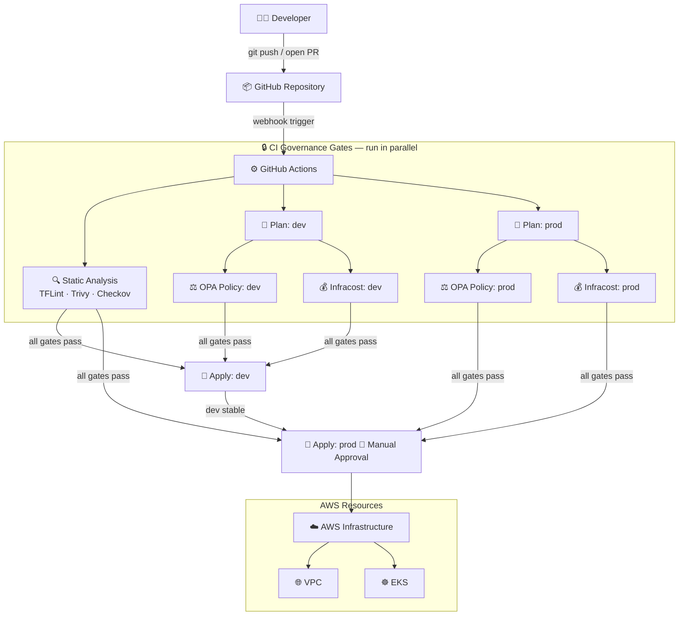
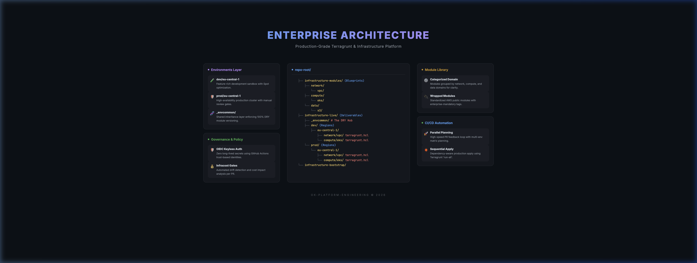
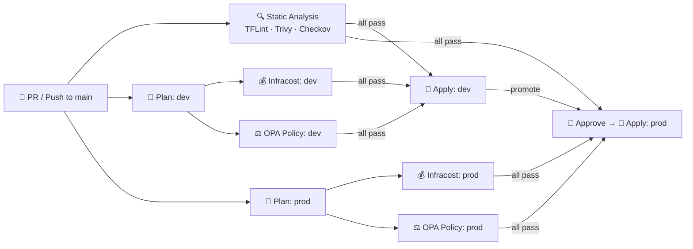
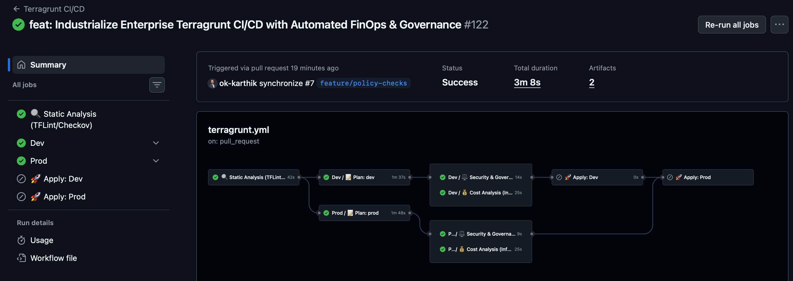
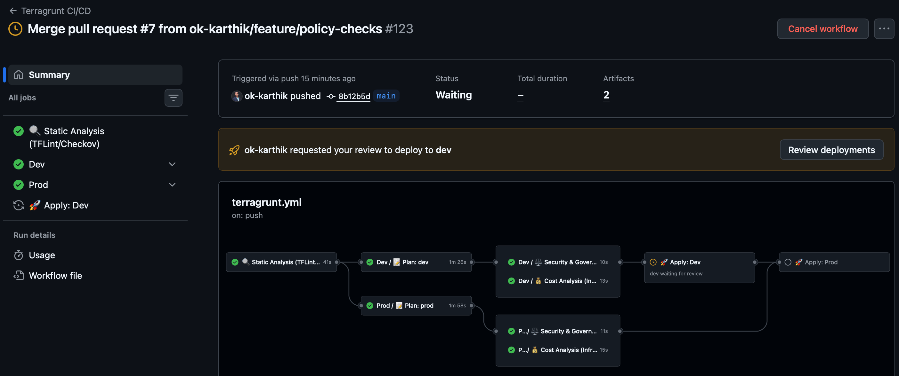
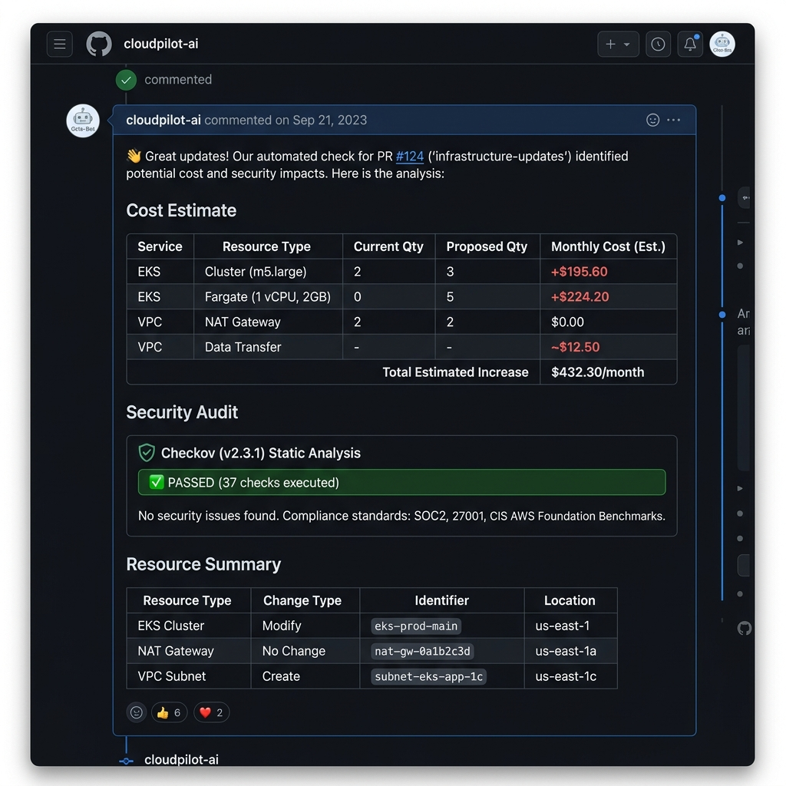
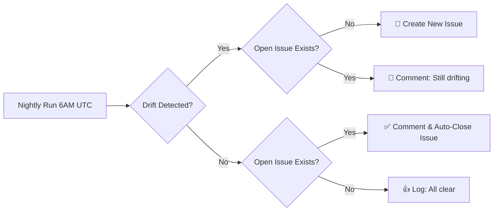
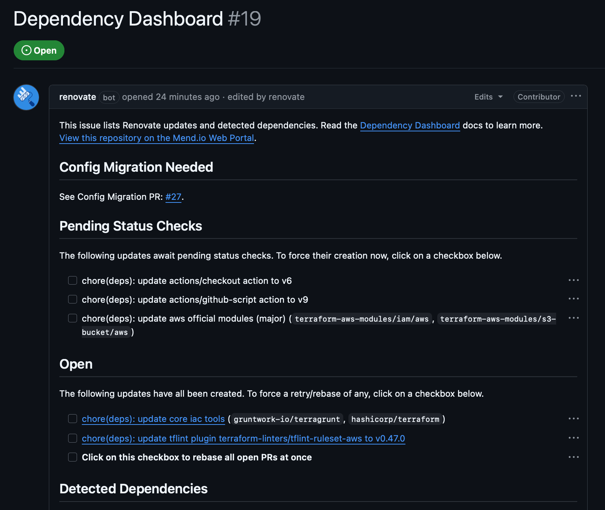
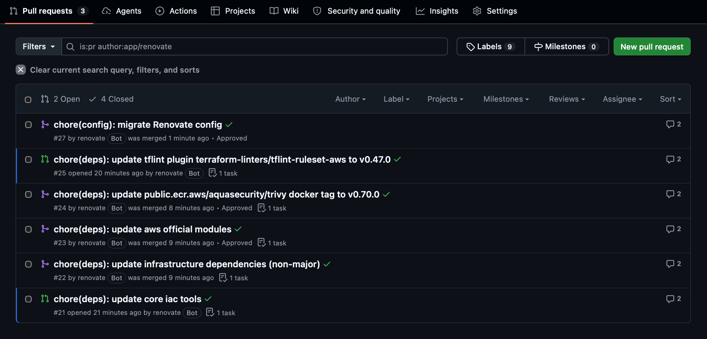
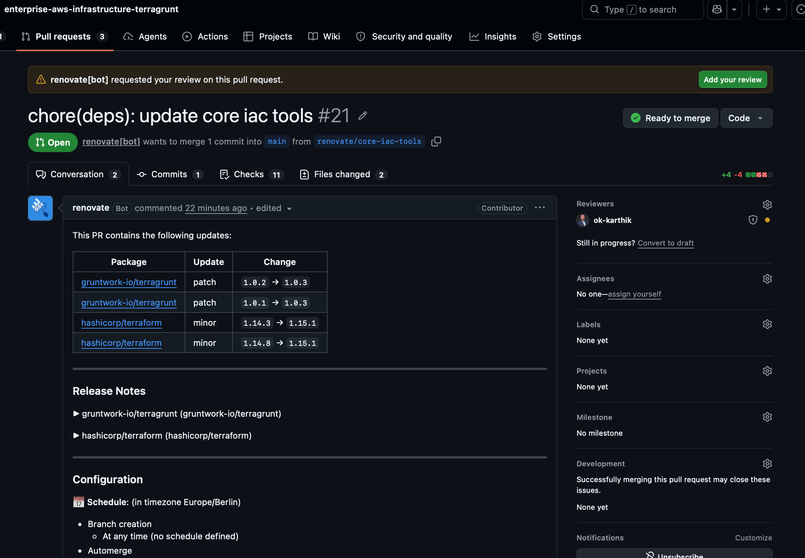

# 🏗️ Enterprise AWS Infrastructure Platform (Terragrunt)

[](https://terragrunt.gruntwork.io/)
[](https://www.terraform.io/)
[](https://www.openpolicyagent.org/)
[](https://www.infracost.io/)
[](https://www.checkov.io/)
[](https://github.com/aquasecurity/trivy)
[](https://github.com/renovatebot/renovate)
[](LICENSE)

A production-grade, multi-environment AWS infrastructure platform built with Terragrunt and Terraform. This project demonstrates **Staff Engineer level patterns** in Infrastructure-as-Code (IaC)—fully DRY, secure, observable, and automated for high-scale engineering teams.

> **Stack:** Terragrunt 1.x · Terraform 1.15 · GitHub Actions · OPA/Conftest · Infracost · Trivy · Checkov · TFLint · RenovateBot · AWS EKS · AWS VPC

---

## 📋 Table of Contents

- [Architecture](#️-project-architecture)
- [Repository Structure](#-repository-structure)
- [CI/CD Pipeline](#-the-automated-cicd-pipeline)
- [Nightly Drift Detection](#-nightly-drift-detection)
- [Automated Dependency Management](#-automated-dependency-management-renovate)
- [Security & Governance](#-security--governance)
- [FinOps & Cost Efficiency](#-finops--cost-efficiency)
- [Disaster Recovery](#️-disaster-recovery)
- [Getting Started](#️-getting-started)
- [Roadmap](#-roadmap-agentic-ai-integration)

---

## 🏛️ Project Architecture

This platform follows a **Hierarchical Blueprint Pattern** using Terragrunt. It strictly separates the "Generic Blueprint Library" (`infrastructure-modules`) from the "Live Environment Implementation" (`infrastructure-live`), ensuring 100% DRY (Don't Repeat Yourself) configuration.

### 🗺️ High-Level Flow



<p align="center">
  
  <br>
  <i>High-fidelity enterprise architecture blueprint for the platform.</i>
</p>

---

## 📁 Repository Structure

```text
.
├── .github/
│   ├── actions/                    # 🧩 Composite Actions (Reusable CI steps)
│   │   ├── setup-platform/         #   • OIDC auth, region, role assumption
│   │   └── static-analysis/        #   • TFLint, Trivy, Checkov runner
│   ├── assets/                     # 🖼️ Documentation images & architecture diagrams
│   ├── docker/
│   │   └── Dockerfile              # 🐳 Infrastructure Toolchain image definition
│   └── workflows/
│       ├── terragrunt.yml          # 🚀 Main CI/CD orchestrator (PR & Push)
│       ├── reusable-terragrunt.yml # 🔁 Reusable Plan/Apply workflow per environment
│       ├── drift-detection.yml     # 🔍 Nightly self-healing drift monitor
│       ├── destroy.yml             # 🌪️ Manual teardown workflow (with safety gate)
│       └── publish-toolchain.yml   # 🐳 Builds & publishes the toolchain image
│
├── infrastructure-bootstrap/       # 🗝️ Day-0 Foundation (OIDC role & S3 state)
├── infrastructure-live/            # 🚀 Live Environment Configuration
│   ├── root.hcl                    #   • Global Terragrunt root config
│   ├── _envcommon/                 #   • DRY inheritance: shared configs
│   ├── dev/eu-central-1/           #   • Dev environment modules
│   │   ├── network/vpc/
│   │   └── compute/eks/
│   ├── prod/eu-central-1/          #   • Prod environment modules
│   │   ├── network/vpc/
│   │   └── compute/eks/
│   └── scripts/
│       ├── smoke-test.sh           #   • Local pre-commit validation suite
│       ├── generate-module.sh      #   • Scaffolds new modules
│       └── check-licenses.sh       #   • Open-source license compliance
│
├── infrastructure-modules/         # 📦 Blueprint Library (Reusable Terraform)
│   ├── network/vpc/                #   • Hardened VPC, NACLs, Flow Logs
│   └── compute/eks/                #   • Production-grade EKS with KMS encryption
│
├── policies/terraform/             # ⚖️ OPA Rego Policy Library
├── renovate.json                   # 🤖 Automated dependency management config
├── GOVERNANCE.md                   # 📜 Tagging, IAM, and compliance rules
├── FINOPS.md                       # 💰 Cost optimization strategy
└── DISASTER_RECOVERY.md            # 🚑 Runbooks for failure modes and rollbacks
```

---

## 🚀 The Automated CI/CD Pipeline

The platform's core is a sophisticated **multi-stage pipeline** managed via GitHub Actions. It combines **Parallel Execution**, **Reusable Workflows**, and **Composite Actions** to deliver fast, safe, and observable deployments.

### 📈 Pipeline Flow



<p align="center">
  
  <br>
  <i>The multi-stage pipeline with parallel governance gates and sequential environment promotion.</i>
</p>

### 🔑 Key Pipeline Features

#### 1️⃣ Gate 1: High-Speed Static Analysis
Runs in parallel with the plan stages to provide immediate feedback:
- **[TFLint](https://github.com/terraform-linters/tflint)**: HCL quality and AWS provider best-practices.
- **[Trivy](https://github.com/aquasecurity/trivy)**: IaC misconfigurations scanned against CVE databases.
- **[Checkov](https://www.checkov.io/)**: Baseline compliance checks against CIS benchmarks.

#### 2️⃣ Gate 2: Cost Governance (Infracost)
Every PR automatically posts an itemized cost breakdown using **[Infracost](https://www.infracost.io/)**.

```text
Project: .../compute/eks/tfplan.json
 Name                                              Monthly Qty  Unit     Monthly Cost
 module.eks.aws_eks_cluster.this[0]                        730  hours          $73.00
 ─────────────────────────────────────────────────────────────────────────────────────
 OVERALL TOTAL                                                                 $92.19
```

#### 3️⃣ Gate 3: High-Precision Governance (OPA)
After planning, the pipeline validates the **Terraform plan JSON** (not just HCL) against strict **OPA Rego policies**:
- **🏷️ Mandatory Tagging**: Enforces `Service`, `Environment`, `Project`, and `ManagedBy` tags on all resources. Missing tags fail the pipeline.
- **💻 Instance Modernization**: Blocks legacy AWS instance families (e.g., `t2.*`).

#### 4️⃣ Manual Approval Gate (Protected Environments)
`prod` deployments are protected by a **GitHub Environment** that requires explicit manual approval before `apply` proceeds.

<p align="center">
  
  <br>
  <i>The GitHub Actions manual approval gate for production deployments.</i>
</p>

#### 5️⃣ Automated PR Audit Report
The pipeline posts a full consolidated report to every PR:

<p align="center">
  
  <br>
  <i>Automated PR audit: cost impact, security findings, and resource changes in one view.</i>
</p>

---

## 🔍 Nightly Drift Detection

A dedicated **nightly workflow** (`drift-detection.yml`) monitors both `dev` and `prod` environments in **parallel** using a matrix strategy. It compares live AWS infrastructure against the Terraform state/code and automatically manages GitHub Issues as its alerting mechanism.

### 🌊 Self-Healing Issue Lifecycle



**Key behaviours:**
- **Deduplication**: Never creates duplicate issues. Each environment (`dev`/`prod`) has at most one open drift issue.
- **Persistence Tracking**: Comments on the existing issue each day drift remains, creating an audit trail.
- **Auto-Remediation**: When drift is resolved (e.g., after a deploy), the workflow automatically closes the issue with a resolution message—no manual cleanup required.
- **Environment Isolation**: Each environment uses its own IAM role (`AWS_DEV_ROLE_ARN` / `AWS_PROD_ROLE_ARN`) for independent, isolated checks.

> **Required Repository Variables**: `AWS_DEV_ROLE_ARN`, `AWS_PROD_ROLE_ARN`, `AWS_REGION`

---

## 🤖 Automated Dependency Management (Renovate)

The platform uses **[RenovateBot](https://github.com/renovatebot/renovate)** with custom regex managers for **zero-touch maintenance** of all infrastructure dependencies.

### What Renovate Tracks Automatically

| Dependency Type | Source | Example |
| :--- | :--- | :--- |
| Terraform Registry Modules | `.hcl` files (`tfr://` protocol) | `terraform-aws-modules/vpc/aws` |
| Toolchain Binaries | `Dockerfile` ARGs | `TERRAFORM_VERSION`, `TERRAGRUNT_VERSION` |
| GitHub Actions | `action.yml` files | `actions/checkout`, `docker/build-push-action` |
| Composite Action Inputs | `.github/actions/*/action.yml` | `TFLint`, `Infracost` versions |

### Update Strategy

- **Non-Major Updates**: Patch and minor bumps are grouped into a single "Infrastructure Dependencies" PR to reduce noise.
- **Major Updates**: Separated into individual PRs for explicit review.
- **Dependency Dashboard**: A GitHub Issue acts as a central control panel to see all pending updates and manually trigger PRs.
- **Scheduling**: Runs on Berlin timezone (`Europe/Berlin`), respecting business hours.

<p align="center">
  
  
  
  <br>
  <i>The Renovate lifecycle: centralized dashboard → automated PR grouping → high-fidelity PR details with release notes.</i>
</p>

---

## 🔐 Security & Governance

### 🪪 Zero-Key OIDC Authentication
No long-lived AWS credentials exist anywhere. All CI/CD pipeline runs use **GitHub Actions OIDC** to assume short-lived IAM roles scoped to the specific repository and branch.

### 🛡️ Multi-Layer Security Scanning

| Tool | Stage | Scope |
| :--- | :--- | :--- |
| **TFLint** | Pre-Plan (HCL) | Best-practice violations, deprecated arguments |
| **Trivy** | Pre-Plan (HCL) | IaC misconfigurations, CVE database checks |
| **Checkov** | Post-Plan (JSON) | CIS benchmark, deep plan-level analysis |
| **OPA/Conftest** | Post-Plan (JSON) | Custom Org-level Rego policies |

All scanners are configured as **strict blocking gates** — any High or Critical finding returns `exit code 1` and halts the pipeline.

### 📦 Module-Level Security Hardening

Security defaults are enforced at the source code level in `infrastructure-modules/`, not just in CI:

**VPC (`network/vpc`)**
- Default NACL replaced with explicit Deny-All ingress rules.
- Default Security Group managed as a "Black Hole" (zero ingress/egress).
- **VPC Flow Logs** enabled with CloudWatch integration for full network audit trails.

**EKS (`compute/eks`)**
- Kubernetes Secrets encrypted at rest via dedicated **AWS KMS keys**.
- Control Plane Logging enabled for: API Server, Authenticator, Controller Manager, Audit.

**S3 State Backend**
- **DynamoDB Locking**: Prevents concurrent apply corruption.
- **S3 Versioning**: Enables point-in-time state rollback.
- **Block Public Access**: Enforced at both bucket and account level.
- **Server-Side Encryption**: AES-256 for all state data at rest.

For the complete tagging policy and branch protection rules, see [GOVERNANCE.md](GOVERNANCE.md).

---

## 💰 FinOps & Cost Efficiency

| Strategy | Impact |
| :--- | :--- |
| **Spot Instance Orchestration** (Dev EKS) | Dev spend: **$1,200 → $180/month (-85%)** |
| **GP3 Storage Mandate** (OPA Policy) | Enforces optimal EBS performance/cost ratio |
| **Manual Teardown Workflow** | Surgical destruction of non-prod resources on demand |
| **Infracost PR Gate** | 100% cost visibility before any change reaches production |

For full details, see [FINOPS.md](FINOPS.md).

---

## 🚑 Disaster Recovery

The platform follows a **"Roll-Forward, Never Rollback"** philosophy, backed by S3 state versioning and DynamoDB locking.

Key runbooks documented in [DISASTER_RECOVERY.md](DISASTER_RECOVERY.md):
- **Apply Fails Halfway**: How partial state is handled safely.
- **Locked State Files**: How to break a DynamoDB lock after a crashed runner.
- **State Corruption**: How to restore a known-good state version from S3 versioning.
- **Manual State Surgery**: Using `terragrunt state rm` and `import` for stuck resources.

### 🧪 Automated Smoke Test
A pre-commit hook runs [`smoke-test.sh`](infrastructure-live/scripts/smoke-test.sh) locally before every commit to validate:
1. **Compliance**: Regional naming and environment structure.
2. **HCL Formatting**: `terraform fmt` check across all directories.
3. **Module Init & Validate**: Automatically re-initializes modules after version changes (handles Renovate bumps).
4. **TFLint**: Full recursive lint pass across all modules.

---

## 🛠️ Getting Started

### 📋 Prerequisites

| Tool | Version | Install |
| :--- | :--- | :--- |
| Terraform | `>= 1.15.1` | `brew install terraform` |
| Terragrunt | `>= 1.0.3` | `brew install terragrunt` |
| TFLint | `>= 0.62.0` | `brew install tflint` |
| Trivy | `>= 0.70.0` | `brew install trivy` |
| Conftest | `>= 0.68.2` | `brew install conftest` |
| AWS CLI | `v2` | [Official Docs](https://docs.aws.amazon.com/cli/latest/userguide/install-cliv2.html) |
| pre-commit | latest | `brew install pre-commit` |

### 💻 Local Development Setup

```bash
# 1. Clone the repository
git clone https://github.com/ok-karthik/enterprise-aws-infrastructure-terragrunt.git
cd enterprise-aws-infrastructure-terragrunt

# 2. Install pre-commit hooks (runs smoke-test on every commit)
pre-commit install

# 3. Run the full validation suite manually
./infrastructure-live/scripts/smoke-test.sh
```

### 🗝️ Day-0 Bootstrap (First-Time Setup)

The `infrastructure-bootstrap/` directory provisions the foundational AWS resources required before any live infrastructure can be deployed:
- OIDC Identity Provider for GitHub Actions
- S3 bucket for Terraform remote state
- DynamoDB table for state locking
- IAM roles for CI/CD (`github-actions-oidc-role`)

See [infrastructure-bootstrap/README.md](infrastructure-bootstrap/README.md) for the full setup guide.

### 🔧 Local Validation Commands

```bash
# Lint all HCL
tflint --init && tflint --recursive

# Security scan
trivy config .

# Policy check (requires a plan JSON)
conftest test --policy policies/ <plan.json>

# Scaffold a new module
./infrastructure-live/scripts/generate-module.sh <module-name>
```

---

## 🤖 Roadmap: Agentic AI Integration

The next phase integrates **AI Agents** directly into the CI/CD pipeline:

- **🔒 Security Remediation Agent**: Analyzes Checkov/Trivy findings and auto-suggests exact remediation code or suppression blocks.
- **🌀 Automated Drift Response Agent**: Reads the nightly drift detection output and automatically generates a PR with the code or state commands needed to resolve the drift.
- **💬 Natural Language to IaC**: An experimental agent translating plain-text requests (e.g., *"Give me a highly available RDS Postgres cluster"*) into fully compliant, tagged Terragrunt configurations.

---

## 📚 Related Standards & Inspiration

- [AWS Well-Architected Framework](https://aws.amazon.com/architecture/well-architected/)
- [HashiCorp Terraform Best Practices](https://developer.hashicorp.com/terraform/tutorials/best-practices/well-architected-framework)
- [Terragrunt Documentation](https://terragrunt.gruntwork.io/docs/)
- [CNCF Cloud Native Landscape](https://landscape.cncf.io/)

---

## 🤝 Contributing

1. **Fork** the repository.
2. **Create a feature branch**: `git checkout -b feat/your-feature`
3. **Validate locally**: Pre-commit hooks will run automatically on `git commit`.
4. **Open a PR**: The full 5-stage pipeline runs automatically.

---

*This platform is maintained as a showcase of senior Infrastructure-as-Code (IaC) patterns and Staff Engineer-level GitOps practices. For professional inquiries, reach out to [ok-karthik](https://github.com/ok-karthik).*
