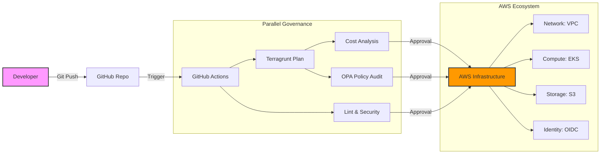
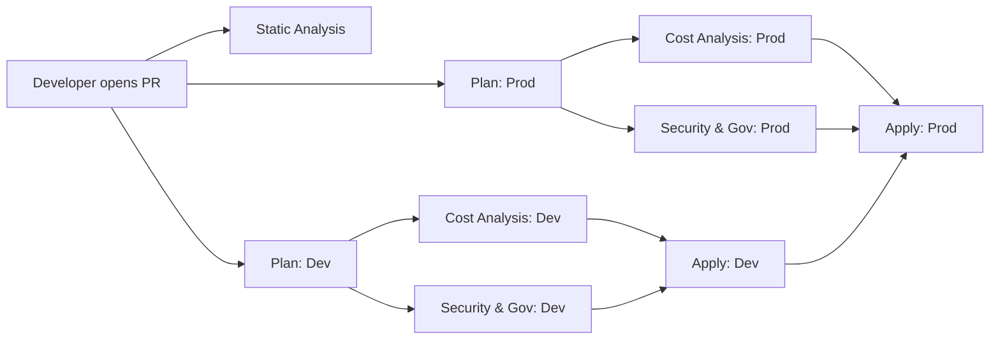

# 🏗️ Enterprise AWS Infrastructure (Terragrunt & Terraform)

[](https://terragrunt.gruntwork.io/)
[](https://www.terraform.io/)
[](https://www.openpolicyagent.org/)
[](https://www.infracost.io/)
[](https://www.checkov.io/)
[](LICENSE)

A production-grade, multi-environment AWS infrastructure blueprint designed for scalability, security governance, and FinOps efficiency. This project demonstrates **Staff Engineer level patterns** in Infrastructure-as-Code (IaC) management—fully DRY, observable, and automated for high-scale engineering teams.

---

## 🏛️ Project Architecture

This platform follows a **Hierarchical Blueprint Pattern** using Terragrunt. It separates the "Generic Blueprint Library" from the "Live Environment Implementation," ensuring 100% DRY (Don't Repeat Yourself) code.

### 🗺️ High-Level Flow


### 🧬 Repository Structure

```text
.
├── infrastructure-modules/      # 📦 Blueprint Library (Reusable Terraform)
│   ├── network/vpc/            # • Standardized VPC & Subnets
│   ├── compute/eks/            # • Production-Grade EKS
│   └── data/s3/                # • Durable Object Storage
│
├── infrastructure-live/         # 🚀 Deployment Hub (Environment Config)
│   ├── _envcommon/             # 🧬 Centralized DRY inheritance layer
│   ├── dev/ (Regions)          # Sandbox Environment
│   │   └── eu-central-1/
│   │       ├── network/vpc/    #   - terragrunt.hcl
│   │       └── compute/eks/    #   - terragrunt.hcl
│   └── prod/ (Regions)         # Production Environment
│       └── eu-central-1/
│           ├── network/vpc/    #   - terragrunt.hcl
│           └── compute/eks/    #   - terragrunt.hcl
│
└── infrastructure-bootstrap/   # 🗝️ Foundation (OIDC & Remote State Hub)
```

---

## 🤝 Contributing

- 1️⃣ **Fork the repo**
- 2️⃣ **Create a feature branch** (`feat/your-name`)
- 3️⃣ **Validate locally**: `tflint --recursive && checkov -d .`
- 4️⃣ **Submit a PR**: The automated pipeline runs automatically.

---

## 🚀 The Automated Platform (CI/CD)

The core of this platform is a sophisticated **5-Stage Pipeline** that transitions infrastructure from code to production with multiple security and cost gates.

### 🏗️ Dual-Gate Pipeline Architecture
The platform utilizes a **Modular CI/CD Orchestration** model built on GitHub Reusable Workflows and Composite Actions.

> **Outcome:** CI/CD pipeline now supports **parallel environment planning and decoupled security/cost scanning**, cutting the time from PR to Prod from **3 days → 3 minutes**.

1.  **Gate 1: High-Speed Static Analysis (HCL)**
    *   **Goal**: Immediate feedback for developers.
    *   **Tools**: [TFLint](https://github.com/terraform-linters/tflint) (Quality), [Trivy](https://github.com/aquasecurity/trivy) (IaC Security), [Checkov](https://github.com/bridgecrewio/checkov) (Basic HCL misconfigs).
2.  **Gate 2: High-Precision Governance (JSON)**
    *   **Goal**: Final safety check before deployment.
    *   **Tools**: Checkov (JSON Plan), [OPA](https://www.openpolicyagent.org/) (Rego laws).

#### 📈 CI/CD Pipeline Flow (Parallel Architecture)


> **Note:** All architecture and flow diagrams use a flat, monochrome style for visual consistency.

#### 1️⃣ Parallel Execution Strategy
The pipeline explicitly strips away sequential constraints (e.g., waiting for static analysis) to allow `dev` and `prod` planning to happen **simultaneously**. Security and cost gates also run in parallel immediately following the plan, ensuring lightning-fast developer feedback loops.

#### 2️⃣ Automated PR Cost Auditing
The pipeline posts a consolidated report to the PR using [Infracost](https://www.infracost.io/). Below is a high-fidelity representation:

```text
Project: .../compute/eks/tfplan.json
 Name                                             Monthly Qty  Unit         Monthly Cost
 module.eks.aws_eks_cluster.this[0]                       730  hours              $73.00
 ... [view full report in PR]
 OVERALL TOTAL                                                                    $92.19
```

---

## 📊 PR-Driven FinOps & Governance

Every Pull Request automatically triggers a comprehensive audit across all environments. This ensures 100% visibility into cost impacts before code reaches production.

### 🛡️ Automated Quality Gates (Strict Blocking)
*   **Cost Estimation (Infracost)**: High-fidelity monthly cost impact per environment.
*   **Change Auditing (tf-summarize)**: Human-readable tables of every resource being Added, Deleted, or Modified.
*   **Hard Security Gates**: Automated Checkov and Trivy scans return `exit code 1` on High/Critical vulnerabilities, strictly blocking deployment.
*   **Signal-to-Noise Focus**: Upstream community modules are explicitly ignored, and dynamic KMS key evaluation errors are suppressed, ensuring developers only see actionable security alerts.

### 📝 Sample PR Report
The pipeline posts a consolidated report for each environment (**dev** and **prod**) to the PR conversation.

<p align="center">
  
  <br>
  <i>Typical PR audit generated by the pipeline – cost impact, security findings, and resource changes in one view.</i>
</p>

<details><summary><b>View Raw Report Structure</b></summary>

#### 📊 Infrastructure Change Summary (dev)
📂 **Module: compute/eks**
```text
+----------+-----------------------------------------------------------+
|  CHANGE  |                         RESOURCE                          |
+----------+-----------------------------------------------------------+
| add (37) | module.eks.aws_eks_cluster.this[0]                        |
|          | ... [view full]                                           |
+----------+-----------------------------------------------------------+
```
</details>

---

## 🔐 Security & Governance

*   **OIDC Authentication**: Zero long-lived AWS keys. All deployments use short-lived, trust-based OIDC tokens (OpenID Connect).
*   **Least Privilege**: The CI/CD role is strictly scoped to specific IAM actions and repository branches.

### ⚖️ Governance & Policy (OPA)
We use **Open Policy Agent (OPA)** via **Conftest** to enforce custom organizational "laws."

> **Impact:** While Checkov scans for baseline CVEs, OPA ensures custom Org-level laws like **100% mandatory tagging** and **0% t2.* instance usage**, significantly reducing policy drift.

*   **🏷️ Mandatory Tagging**: Enforces `Service`, `Environment`, and `Project` tags on all resources.
*   **💻 Instance Modernization**: Prevents the use of legacy AWS instance types (e.g., `t2.*`).
*   **🔌 Sequential Dependency Gates**: Automated validation using `terragrunt run --all` to respect the infrastructure dependency graph.

---

## 🤖 Automated Dependency Management (Renovate)

The platform is designed for **Zero-Touch Maintenance**. We use [RenovateBot](https://github.com/renovatebot/renovate) with custom regex managers to automatically track and update infrastructure dependencies across all `.hcl` files, GitHub Actions, and Dockerfiles.

### 🛡️ Automated Lifecycle & Governance
*   **Terragrunt Module Tracking**: Custom managers track `tfr://` registry versions for all infrastructure modules.
*   **Security Toolchain**: Automatically keeps Trivy, TFLint, and Checkov up to date.
*   **Non-Major Grouping**: Patch and minor updates are consolidated into single "Infrastructure Dependencies" PRs to reduce noise.

<p align="center">
  
  
  
  <br>
  <i>The Renovate lifecycle: Centralized dashboard, automated PR grouping, and high-fidelity PR details with release notes.</i>
</p>

---


The platform has transitioned from a "Reporting" state to a **"Remediated at Source"** architecture. We enforce production-grade security defaults directly within the infrastructure modules to minimize the attack surface.

### 📦 S3 Remote State & Concurrency (Day 2 Ops)
Managing state at scale requires strict concurrency controls and disaster recovery mechanisms:
*   **DynamoDB State Locking**: Terragrunt natively leverages DynamoDB to lock the state file during execution, preventing race conditions and concurrent apply corruption.
*   **S3 Versioning**: All Terragrunt state buckets have **Versioning strictly enabled** for disaster recovery and point-in-time state rollback.
*   **Public Access Block (BPA)**: Strict enforcement of S3 Block Public Access (ACLs, Policies, and Bucket-level) to prevent data leakage.
*   **Server-Side Encryption**: 100% of state data is encrypted at rest using AES-256.

### 🌐 VPC Perimeter Security (Zero-Trust)
*   **Default NACL Management**: Explicit management of the default Network ACL to replace "Allow-All" defaults with restricted ingress/egress rules.
*   **Security Group Hardening**: The default VPC Security Group is managed as a "Black Hole" (Deny-All) to ensure no unmanaged traffic enters the network.

### ☸️ EKS Compute Hardening
*   **Secrets Encryption**: Enabled KMS-based encryption for all Kubernetes Secrets at rest using dedicated, rotating AWS KMS keys (`AWS-0039`).
*   **Control Plane Logging**: Full audit trails for API server, Authenticator, and Controller Manager are enabled by default.

---

## 💰 FinOps & Efficiency

*   **Spot Instance Savings**: In the `dev` environment, EKS node groups use Spot capacity.
    *   **Outcome:** Spot usage cut dev-environment spend from **$1,200 → $180/month (-85%)**.
*   **GP3 Storage Mandate**: Automated governance ensures all EBS volumes are provisioned as `gp3`, optimizing for both performance and price.
*   **Lifecycle Management**: A dedicated **Manual Teardown Workflow** allows for surgical removal of resources in non-production environments.

---

## 🌪️ Disaster Recovery & Business Continuity

The platform is designed with a **Recovery Point Objective (RPO)** of near-zero and a fast **Recovery Time Objective (RTO)** through automated orchestration.

### 🧪 Automated Smoke Tests
We provide a dedicated [smoke-test.sh](infrastructure-live/scripts/smoke-test.sh) that validates the platform's readiness.
*   **HCL Integrity**: Ensures all code is syntactically valid.
*   **Dependency Graph**: Validates that Terragrunt can resolve all module relationships.
*   **Compliance Check**: Ensures 100% regional and environmental naming compliance.

---

## 🤖 Coming Up: Agentic AI Integration (Roadmap)

To push the boundaries of automated DevOps, the next phase of this platform focuses on integrating **AI Agents** directly into the CI/CD pipeline using Python and Open-Source/Free-Tier LLMs.

*   **Security Remediation Agent**: An AI agent that analyzes security vulnerabilities caught by Checkov or Trivy, identifies the missing code, and suggests the exact remediation or suppression block.
*   **Automated Drift Response Agent**: An AI agent that analyzes the output of the nightly drift detection workflow and automatically generates a Pull Request with the relevant code or state manipulation commands needed to resolve the drift.
*   **Natural Language to IaC**: An experimental agent capable of turning plain-text infrastructure requests (e.g., "Give me a highly available RDS Postgres instance") into fully compliant Terragrunt/Terraform code, directly integrated into the repository workflow.

---

## 🛠️ Getting Started

### 📋 Prerequisites
*   [Terraform](https://developer.hashicorp.com/terraform/downloads) (v1.14.3+)
*   [Terragrunt](https://terragrunt.gruntwork.io/docs/getting-started/quick-start/) (v1.0.2+)
*   [TFLint](https://github.com/terraform-linters/tflint)
*   [Checkov](https://www.checkov.io/)

### 💻 Local Development Setup
1.  **Clone the Repo**:
    ```bash
    git clone https://github.com/ok-karthik/enterprise-aws-infrastructure-terragrunt.git
    cd enterprise-aws-infrastructure-terragrunt
    ```
2.  **Bootstrap**: See [infrastructure-bootstrap/README.md](infrastructure-bootstrap/README.md) for initial Day-0 setup.

## 🔧 Local Validation
```bash
# Install / validate tools
tflint --init
tflint --recursive
checkov -d .
./infrastructure-live/scripts/smoke-test.sh
```

For deeper reading see the official docs:
- **OPA policies**: [Official Docs](https://www.openpolicyagent.org/docs/latest/)
- **Infracost pricing models**: [Official Docs](https://www.infracost.io/docs/)
- **Terragrunt best-practices**: [Official Docs](https://terragrunt.gruntwork.io/docs/)

---

## 📚 Related Standards & Inspiration
This platform is built upon industry-neutral standards for cloud scale:
- [AWS Well-Architected Framework](https://aws.amazon.com/architecture/well-architected/)
- [CNCF Cloud Native Interactive Landscape](https://landscape.cncf.io/)
- [GitHub Platform Engineering Playbook](https://github.com/github/platform-samples)
- [HashiCorp Well-Architected Framework](https://developer.hashicorp.com/terraform/tutorials/best-practices/well-architected-framework)

---

*This platform is maintained as a showcase of senior Infrastructure-as-Code (IaC) patterns. For professional inquiries or pattern discussions, reach out to [ok-karthik](https://github.com/ok-karthik).*
